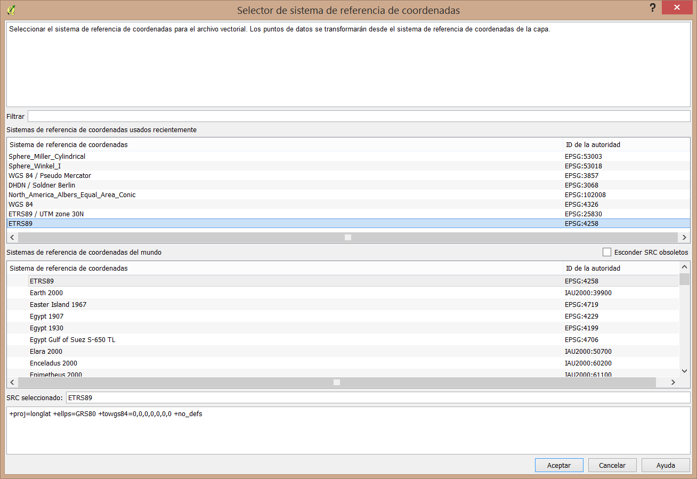
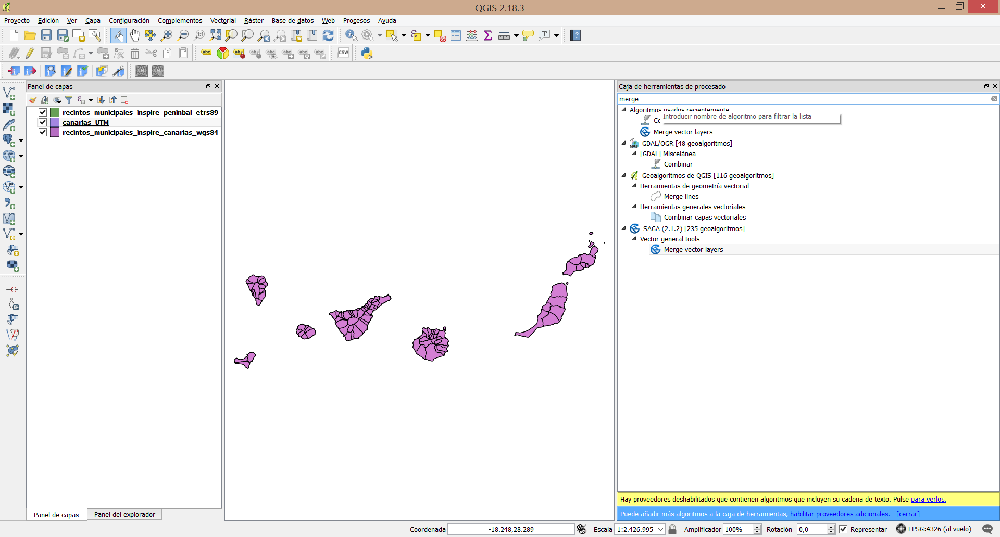
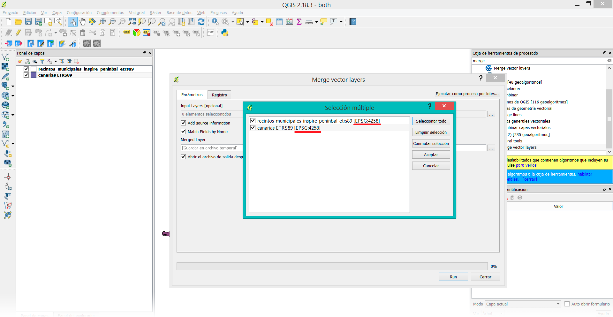
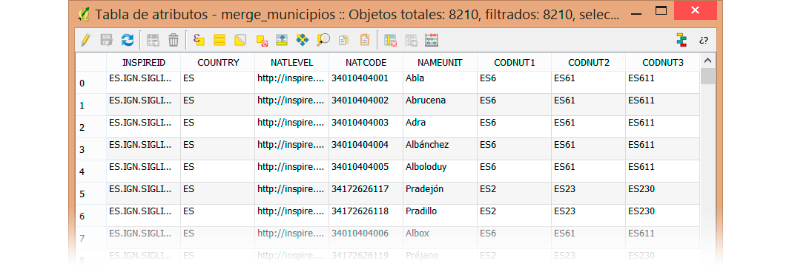
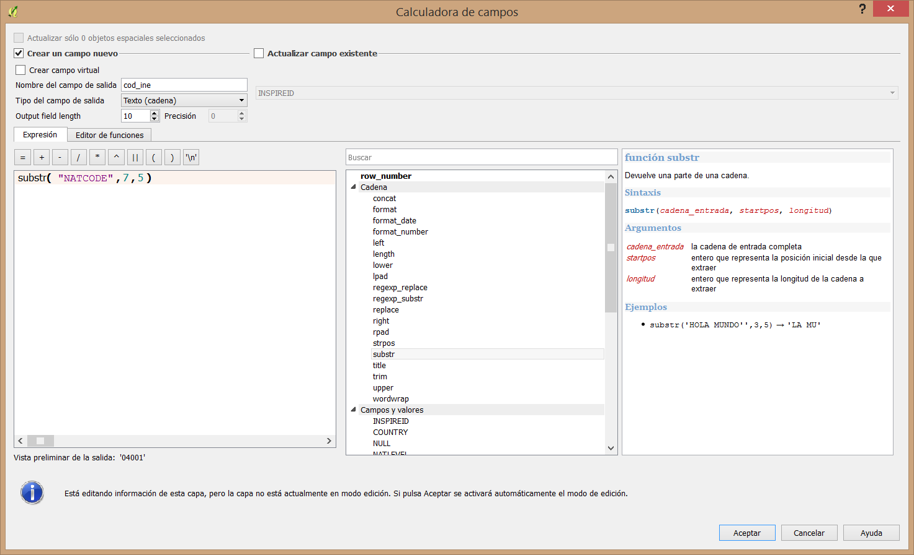
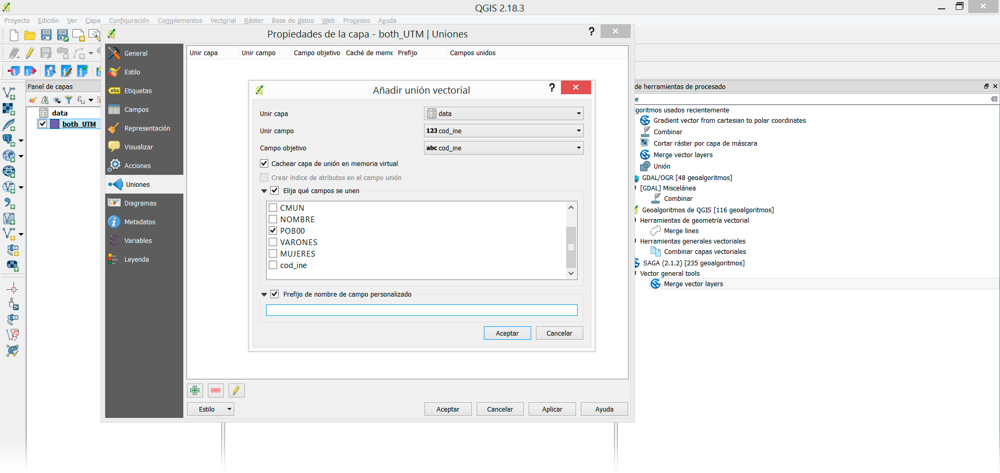
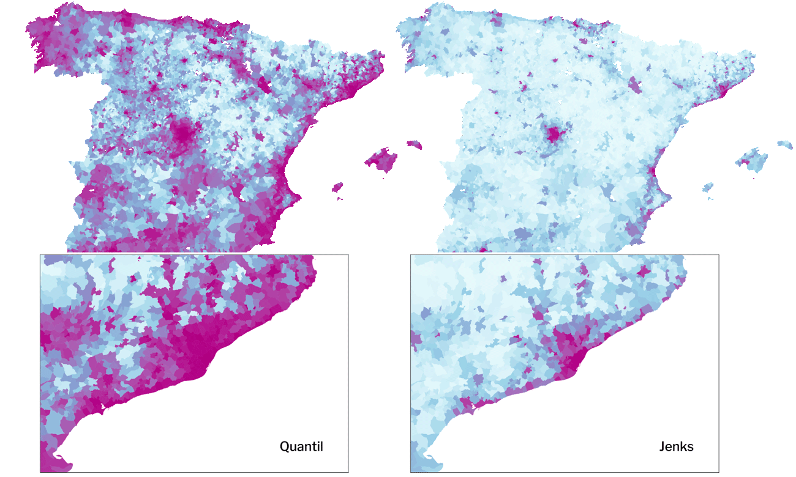
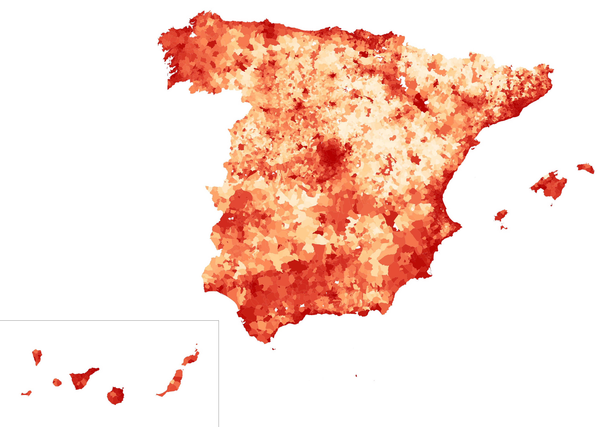
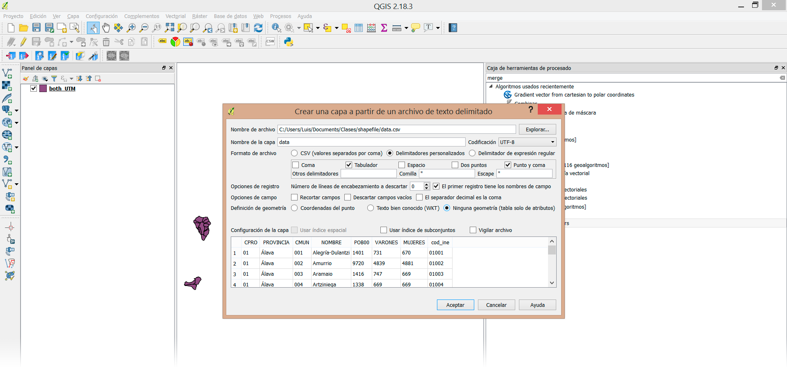
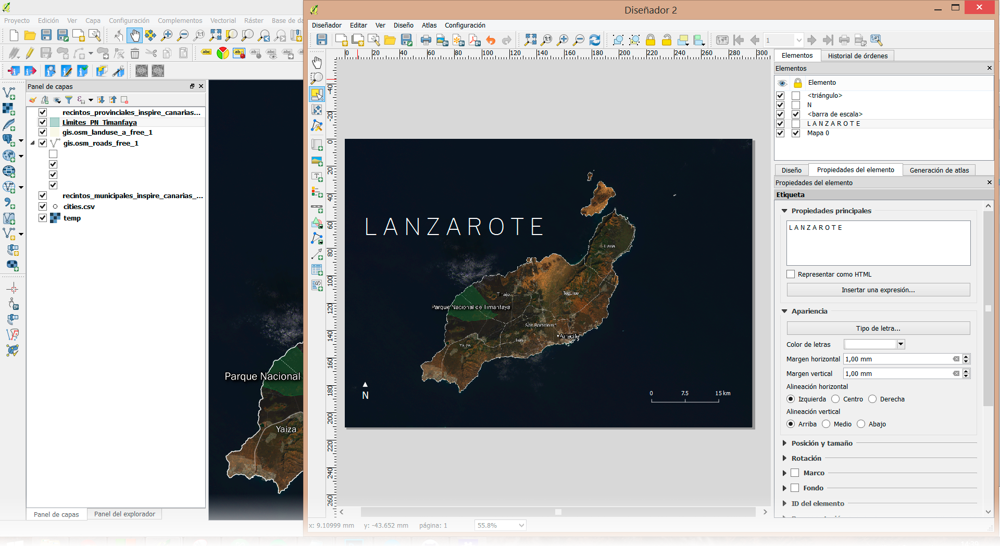

Mapas de carácter informativo en QGIS
=============

En este taller aprenderemos a realizar dos tipos de mapas, un _coropleta_ mostrando la densidad de población y un mapa de la isla de Lanzarote mostrando los principales municipios y el Parque Natural de Timanfaya. Todos los pasos necesarios están descritos aquí abajo.   
### Densidad de población por municipio   

Necesitaremos descargar dos conjuntos de datos, los `shapefiles` y el `csv`. Después cruzaremos los datos mediante el id único de cada municipio. Empecemos:   

1. Descargamos los shapefiles oficiales del enlace del CNIG: **Centro de descargas del Instituto Geográfico Nacional** [Enlace ](http://centrodedescargas.cnig.es/CentroDescargas/equipamiento/lineas_limite.zip). Aquí descargaremos los archivos oficiales en formato _shapefie_ (.shp). Este archivo incluye más shapefiles de los que vamos a necesitar. Si hubiera algún problema con la descarga también se encuentra en la carpeta `shapefiles` del repositorio.    

2. Descomprimimos los archivos. Vamos a trabajar con dos archivos incluidos en dos carpetas diferentes:   
 * `recintos_municipales_inspire_canarias_wgs84`   
 * `recintos_municipales_inspire_peninbal_etrs89`  

 El resto de carpetas contienen las entidades Comunidades Autónomas y Provincias (recintos) además de los contornos (líneas).   
3. Abrimos los dos archivos en QGIS. Es importante seleccionar la **codificación** `UTF-8` para no perder información. Si observamos, el mapa ha adoptado una apariencia _achatada_, QGIS presenta los shapefiles bajo el sistema `WGS84` por defecto. Si deseamos consultar qué proyección es la más adecuada para cada zona del globo, yo suelo consultar [Spatial reference](http://spatialreference.org/) o [bboxFinder](http://bboxfinder.com/#35.791083,25.499268,38.117272,28.927002).  
Si a vosotros os pone tan nerviosos como a mi ver ese mapa mal proyectado, podemos seleccionar la proyección `ETRS89 / UTM zone 30N` ó  `EPSG:25830`) :laughing:.   

	   

4. Tenemos todo el mapa de España por municipios dividido en dos capas, dos archivos diferentes. La siguiente operación será unir o _mergear_ los dos `shapefiles` para conseguir un único archivo que contenga los polígonos de todos los municipios de España.

5. Antes de hacer el `merge` con la península debemos asegurarnos de que los dos archivos se encuentran representados bajo el mismo sistema de coordenadas. Como observamos en el nombre de la carpeta y del archivo, el `shapefile` de las Islas Canarias está utilizando el sistema de coordenadas `WGS84`.   

 Para ello debemos convertir este shapefile generando una copia bajo el sistema `ETRS89`. Pulsamos el botón derecho sobre la capa de Canarias y seleccionamos `guardar como`. En la pestaña de `SRC` . Seleccionamos `ETRS89`.    

	   

 Seleccionamos la opción `Añadir archivo guardado al mapa`. Guardamos.   

 Habremos añadido al mapa un nuevo `shapefile` de Canarias en `ETRS89` (_European Terrestrial Reference System 1989_). Podemos eliminar la capa original de Canarias.    
 A continuación uniremos las dos capas en un sólo archivo. Para que esta operación sea exitosa es fundamental que las dos capas compartan el mismo sistema de coordenadas.   

6. Seleccionamos la pestaña `procesos` del menú superior. Seguidamente `Caja de Herramientas`. Y a continuación la herramienta `Merge Vector Layers` (podemos hacer una búsqueda con `merge` como en la imagen abajo).

	   

	Seleccionamos las dos capas, nombramos nuestro nuevo archivo. Podemos comprobar como las dos se encuentran en `EPSG:4528`.   

	   

	Abrimos nuestro nuevo archivo. Siempre seleccionando la codificación correcta `UTF-8`.
7. **Tabla de atributos**: Podemos acceder con el botón derecho sobre la capa o en el icono . Se nos abrirá la siguiente ventana:   

       

	Gracias a haber seleccionado una correcta codificación vemos como los nombres de los municipios presentan todos sus caracteres correctamente. Una tabla completa de atributos sobre la que podremos realizar casi cualquier tipo de cálculo para filtrar en base a unas reglas, modificar o incluso crear nuevos campos.  

	En este caso nos interesa el campo `NATCODE`: un código único que identifica de manera inequívova a cualquier polígono (en este caso municipio).   

	Podemos extraer el código del **INE** de este campo para poder cruzarlo con el `CSV`. Nuestro objetivo es poder asociar unos valores específicos a cada municipio y para ello necesitamos un `id`.   
	Para éste propósito contamos con la `calculadora de campos` . Hacemos click sobre el icono.   
8. **Calculadora de campos**. En primer lugar introducimos el nombre del campo de salida (será la cabecera de la nueva columna), por ejemplo `cod_ine`. En segundo lugar y **MUY IMPORTANTE** seleccionar el tipo de campo de salida como `Texto` (cadena) ya que queremos preservar los ceros al comienzo de nuestro código cuando éste sea inferior a 5, por ejemplo `04004` y no ~~`4004`~~.  

 Todos los desplegables de la derecha nos permiten ir construyendo una _query_ con la que crearemos el campo y consultar la documentación asociada a cada método.   

	A continuación vamos a utilizar un método del desplegable `Cadena` (String) llamado `substring`. Vamos a extraer parte de ese código y generar un nuevo campo. Este método nos permitirá modificar el valor de una celda en base a tres argumentos:     

	* `cadena_de_entrada` → nombre de la columna de la cual queremos obtener nuestro nuevo campo.   
	* `startpos` → posición inicial desde la que comenzaremos a extraer caracteres (empezando por el primero).
	* `longitud` → longitud de la cadena a extraer.  

 En este caso nuestra fórmula será como muestra la imagen:

 

 En la parte inferior izquierda de la calculadora tenemos una vista preliminar del campo de salida.   

 Si en algún momento de este proceso nos equivocamos deberemos eliminar el campo y crear uno nuevo o actualizarlo en la opción superior derecha `actualizar campo existente` (tan sólo podremos actualizar el contenido, no la naturaleza del campo). Al finalizar deberemos salvar desde la tabla de atributos .   

9. **Añadir un CSV**. A continuación vamos a cargar los datos que queremos asociar a cada municipio. Vamos a utilizar los datos del [Padrón municipal a 1 de enero de 2017](http://www.ine.es/dynt3/inebase/es/index.html?padre=517&dh=1). Este archivo requiere de una pequeña manipulación para extrar el código de municipio (`código de provincia + código de municipio`). Este cálculo podemos hacerlo en Excel, libre office o incluso en QGIS. Es muy importante no perder los ceros por la izquierda. El código **siempre** ha de tener cinco cifras.
Podéis procesar los datos y guardarlos como csv o bien utilizar el csv de la carpeta `data` del repositorio.   

 QGIS tiene una opción muy completa para añadir capas de texto delimitado (csv, tsv, etc.). A día de hoy no he conseguido utilizar esta opción para añadir un csv y no perder los ceros por la izquierda. Por ello añadiremos nuestro csv como hemos hecho anteriormente con los shapefiles. No obstante veremos esta opción ya que es útil para subir por ejemplo un archivo con coordenadas para locaizar puntos en el mapa.    

10. **Uniones**. Hacemos click con el botón derecha sobre nuestro shapefile → propiedades → `Uniones` y en el icono . Seleccionamos la capa con la cual queremos hacer el `join` y los dos campos que cruzaremos. Podemos elegir qué campos queremos unir, en este caso sólo nos interesa el de población.   

	

 Si abrimos la tabla de atributos veremos como hemos añadido un nuevo campo. **PERO** es un campo _virtual_, sólo existe temporalmente y no en el shapefile original. Además no podemos hacer operaciones sobre él. Si creamos una copia de este shapefile se añadirá el nuevo campo como uno más. **botón derecho** → **guardar como** → etc.

11. **Cálculo de densidad**. Volvemos a abrir la calculadora de campos. Seguimos los pasos aprendidos para generar un nuevo campo. Esta vez la densidad de población. Importante:   
 - Seleccionar como tipo de salida de campo `Número decimal (real)`
 - `longitud de campo de salida`: `20`
 - Precision mínimo de `10`.

 Introducimos la siguiente expresión:

		to_real( "data_POB00"  /  $area  ) * 10000   
Dividimos la población entre el área del polígono. Lo multiplicamos por 10.000 para obtener habitantes por hectarea y _parseamos_ el dato a número real (decimal) para conservar los decimales con `to_real(...)`. Esta opeación generará un nuevo campo con la densidad de población por municipio. A continuación
sólo deberemos aplicar una escala de color a nuestros datos.   

	**NUNCA** debemos representar datos absolutos en un mapa. Siempre hemos de ponerlos en contexto con alguna otra variable relativa.

12. **Escalas de color**. A continuación vamos aplicar una escala de color para poder apreciar la densidad de población de cada municipio. En **propiedades** de la capa → pestaña **estilo**  y en el desplegable seleccionamos → _graduado_. En el apartado columna seleccionamos nuestra variable `densidad`, elegimos la rampa o escala de color que queramos y en `Clasificar`. Si elegimos un buen número `Clases` podremos apreciar una mayor precisión en la aplicación del color.  
La opción **Modo** nos permite utilizar diferentes tipos de escalas. En nuestro contexto la opción `Quantil (cuenta igual)` o `Rupturas naturales (Jenks)` nos permiten apreciar mejor la distribución de los valores.

	

	Podéis ampliar información en [este post](http://roadtolarissa.com/coloring-maps/) de [Adam Pearce](https://twitter.com/adamrpearce) sobre las principales escalas.   
13. **Print Composer** Una vez tenemos nuestro mapa queremos crear una imagen a buena resolución de nuestro mapa, listo para publicar. Pulsamos en el icono .
Podemos rellenar el campo nombre. A continuación en añadir mapa .    
Con el ratón pulsado arrastramos desde una esquina hacia la contraria dibujando la extensión del `canvas`. Apareceá exactamente lo mismo que estabamos viendo en la ventana principal de `QGIS`. Existe la posibilidad de eliminar el fondo y exportar la imagen con transparencia (muy útil si luego vamos a trabajar con ella en algún otro programa). En la pestaña `Diseño`del menú derecho	y en el apartado `Configuración de página` seleccionamos `Cambiar`: **borde** y **relleno** transparente.   
En la pesataña 	`Propiedades del elemento` deseleccionamos la pestaña `fondo`.   

	Si queremos crear una composición que incluya las Islas Canarias cerca de la península tendríamos que crear dos mapas en nuestro `print composer`:
	- Sin cerrar esta ventana volvemos a la vista principal de QGIS. Hacemos zoom sobre la península.
	- Volvemos al diseño de impresión y añadimos un nuevo mapa. En esta ocasión debería aparecer sólo la península.
	- De nuevo en la ventana principal hacemos zoom sobre las Canarias. En el diseño de impresión añadimos un nuevo mapa. Aparecerán las Islas Canarias. Podemos ayudarnos de la herrmienta `Mover contenido del elemento`  para manejar mejor las dos capas y de las opciones bloquear del menú superior derecho `Elementos`.   
	- En el apartado `Propiedades principales` podemos servirnos del apartado `Escala` para asegurarnos de que los dos mapas conservan la misma proporción.
	- Si queremos podemos añadir un rectángulo alrededor del archipiélago para remarcar la composición en `Añadir figura geométrica`.

	   

	Tips & tricks
	=============

	Podemos seguir trabajando sobre este mapa o podemos intentar hacer un mapa diferente, más enfocado a un trabajo de reportaje como comentábamos anteriormente.   
	- En las siguientes páginas se pueden `descargar` shapefiles y archivos _raster_ de carácter político, natural, cultural: [Natura Earth Data](http://www.naturalearthdata.com/), [Magrama](http://www.mapama.gob.es/es/cartografia-y-sig/ide/descargas/default.aspx), [Diva-gis.org](http://www.diva-gis.org/gdata), etc.   
	A excepción del Ministerio de Agricultura, no son archivos oficiales, y si queremos hacer mapas con mucho detalle intentaremos siempre acudir a fuentes oficiales. En este sentido, España tiene todavía que mejorar el acceso a este tipo de datos fundamentales para un buen análisis.  

	- `Instalar un plugin`. seleccionamos la pestaña `complementos` de la vista principal → `Administrar e instalar complementos`.

	- `QGIS` tiene multitud de `plugins` que potencian las posibilidades de este software que, no olvidemos, es libre. Entre ellos destaca `OpenLayers Plugin` que nos permite añadir a nuestra composición multitud de capas: `Google Satellite`, `Bing Aerial`, `Google Streets`, etc. Presenta el inconveniente de ser capas **no editables**. No podremos tocar los niveles de las fotos aéreas, filtrar resultados, etc. Accedemos desde la pestaña `web`.

	- Dibujar una serie de puntos en el mapa leyéndo desde un `csv`. Este archivo deberá tener una columna con las coordenadas `longitud` y `latitud`. Si no tenemos un dataset con éstas caracteristicas podemos buscar las principales ciudades de España en google maps y copiar las coordenadas de la `url`.
	La estructura del archivo debería ser algo así:   

			city,lat,lon   
			Madrid,40.4378698,-3.8196211   
			Barcelona,41.3947688,2.0787279   
			...

		Para añadir un `csv` mediante la opción **añadir capa de texto delimitado** seleccionamos `Capa` o el icono de acceso directo . Seleccionamos el archivo desde el explorador, codificación correcta, el delimitador correcto (`;`, `,`, `tabulador`...).    

		   

		Si nuestro objetivo es representar una serie de puntos sobre el mapa y nuestro csv tuviera columnas con los campos `longitud` y `latitud` deberíamos especificarlas en los correspondientes desplegables.   
		Vemos nuestra nueva capa con un icono diferente ya que no es una capa de tipo vectorial.  

		Una vez creada la capa QGIS nos pedira especificar mediante qué sistema de representación van a localizarse nuestros datos. Es MUY IMPORTANTE que seleccionemos la opción `WGS84`. De lo contrario nuestros puntos no se visualizarán correctamente.

### Mapa de la isla de Lanzarote

Realizaremos un mapa de la isla de Lanzarote donde marcaremos los límites del **Parque nacional de Timanfaya**. Necesitaremos:
- **Recintos municipales de Canarias**. Filtraremos para quedarnos sólo con el perteneciente a la isla de Lanzarote. Botón derecho sobre la capa, **FILTRAR** e introducimos la expresión correspondiente: `"CODNUT3" LIKE 'ES708'`.    
- Hacemos lo mismo con la capa de **recintos provinciales**: `"CODNUT3" LIKE 'ES70'`.   
- Añadimos una imagen por satélite del plugin `OSM`.   
- Vamos al **Magrama** y nos descargamos el shapefile del parque natural.
- Podemos descargarnos otros shapefiles del [OpenStreetMap Data Extracts](http://download.geofabrik.de/). Aquí tendremos archivos muy completos de usos del suelo, carreteras, etc.

En el panel de propiedades de una capa tenemos multitud de opciones para controlar el color de relleno, del borde, opacidad. Además, podemos mostrar cualquier campo de la tabla de atributos, como por ejemplo el nombre del parque natural, el nombre del municipio o incluso el nombre de la principal ciudad de la isla cargándolo desde un csv con sus correspondientes coordenadas como vimos más arriba.   

Para estilizar las `etiquetas` o labels seleccionamos de **propiedades** de la capa → **etiquetas** → **mostrar etiquetas para esta capa**. En *etiquetar con* seleccionamos el campo de la tabla de atributos que queremos mostrar. Abajo se encuentran todas las opciones para estilizar el texto: color, tipo de fuente, tamaño, sombra, etc.   

Lo siguiente será ir jugando con niveles de opacidad, filtros y estilos basados en reglas para conseguir un diseño con el que estemos conforme. El objetivo es generar un mapa listo para publicar.   

   

El `print composer` nos permite añadir fácilmante texto sobre nuestra composición, una barra de escala, un indicador del norte, una leyenda, etc. Debemos ir jugando con todos los niveles y opciones hasta encontrar un diseño con el que estemos conforme.   

Este diseño está hecho utilizando exclusivamente QGIS. Este programa nos ofrece una serie de opciones limitadas. Si queremos desarrollar una composición más elaborada con anotaciones, varios mapas, diseños específicos para cada plataforma (escritorio/móvil/tableta) sin duda deberemos ayudarnos de algún otro tipo de programa como Illustrator/Gimp.  

    

Desde el _diseñador_ podemos exportar en png, pdf, vectorial, aunque mi experienca con la exportación a svg no es muy buena. A menudo QGIS crea agrupaciones extrañas de elementos y generalmente los shapefiles tienen demasiado detalle para poder trabajar cómodamente en Illustrator. En ocasiones es más ágil exportar un png de gran calidad y moverlo fácilmente.
