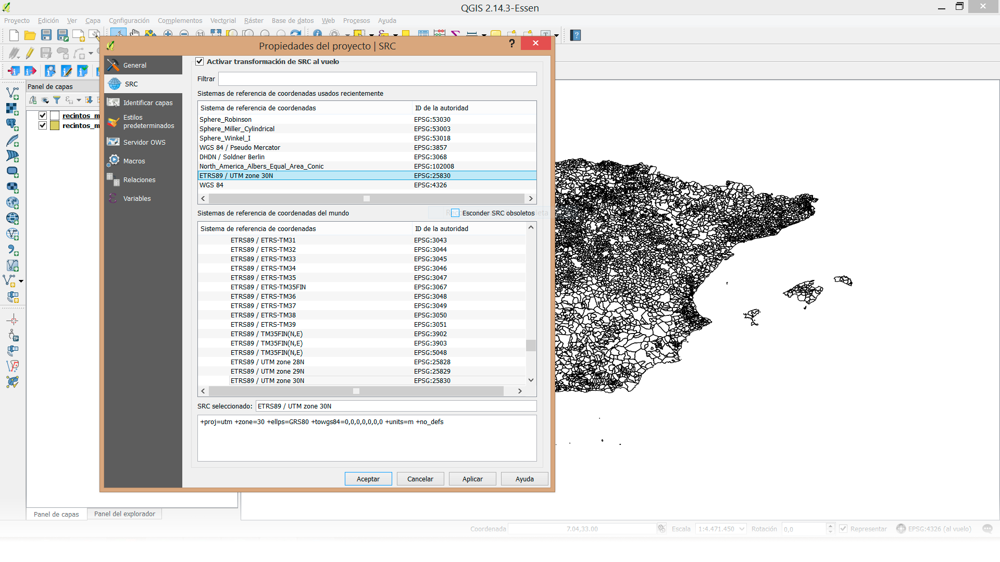

#Como realizar un sencillo mapa de cloropletas en QGIS

En este tutorial aprenderemos a realizar un sencillo mapa de cloropletas con QGIS. Todos los pasos necesarios están descritos aquí abajo. Crearemos un mapa de densidad de población por municipios (renta).   
Necesitaremos descargar dos conjuntos de datos, los `shapefiles` y el `csv`. Después cruzaremos los datos mediante el id único de cada municipio. Empecemos:   

1. Descargamos los shapefiles oficiales del enlace del CNIG:   
	**Centro de descargas del Instituto Geográfico Nacional** [Link ](http://centrodedescargas.cnig.es/CentroDescargas/equipamiento/lineas_limite.zip)   
	En este enlace descargaremos los archivos oficiales en formato _shapefie_ (.shp). Este archivo incluye más shapefiles de los que vamos a necesitar. Si hubiera algún problema con la descarga también se encuentra en la carpeta `shapefiles`del repositorio.    

2. Descomprimimos los archivos. Vamos a trabajar con dos archivos incluidos en dos carpetas diferentes:

	- `recintos_municipales_inspire_canarias_wgs84`   
	- `recintos_municipales_inspire_peninbal_etrs89`   

	El resto de carpetas contienen las entidades Comunidades Autónomas y Provincias (recintos) además de los contornos (líneas).

3. Abrimos los dos archivos en QGIS. Es importante seleccionar la **codificación** `UTF-8` para no perder información. Si observamos, el mapa ha adoptado una apariencia _achatada_ debido a una proyección incorrecta. Es importante que especifiquemos una proyección adecuada en la pestaña inferior derecha.

	   

	Esta opción se conoce como `on the fly` o `al vuelo` ya que realiza un calculo en tiempo real pero no establece una proyección específica a nuestro proyecto. Nos vale.   
	Seleccionamos la proyección `ETRS89 / UTM zone 30N` ó  `EPSG:25830`).   
	Tenemos todo el mapa de España por municipios dividido en dos capas, dos archivos diferentes.   
	La siguiente operación será unir o `mergear` los dos `shapefiles` para conseguir un único archivo que contenga los polígonos de todos los municipios de España.

4. Antes de hacer el `merge` con la península debemos asegurarnos de que los dos archivos se encuentran representados bajo la misma proyección. Como observamos en el nombre de la carpeta y del archivo, el `shapefile` de las Islas Canarias está utilizando el sistema de coordenadas `WGS84`.   
Pulsamos el botón derecho sobre la capa de Canarias y seleccionamos `Establecer SRC de la capa` y seleccionamos `ETRS89 / UTM zone 30N`.   
No nos preocupemos si el archipiélago desaparece de nuestro `canvas` o espacio de trabajo. Es normal ya que ésta capa utiliza `WGS84`.

5. Seleccionamos la pestaña `vectorial` del menú superior. Seguidamente `Herramientas de geoproceso`. Y a continuación `Unión`.

	  

	   

	Seleccionamos como capa *vectorial de entrada* la península y como capa de unión la de las Canarias.

6. **Tabla de atributos**: Podemos acceder con el botón derecho sobre la capa o en el icono . Se nos abrirá la siguiente ventana:
      

	Gracias a haber seleccionado una correcta codificación vemos como los nombres de los municipios presentan todos sus caracteres de manera adecuada. Una tabla completa de atributos sobre la que podremos realizar casi cualquier tipo de cálculo para filtrar en base a unas reglas, modificarlos o incluso crear nuevos campos.  
	En este caso nos interesa el campo `NATCODE`. Esta celda contiene un código único que identifica de manera inequívova a cualquier polígono (municipio). Con una sencilla operación, podemos extraer el código del **INE** de este campo. No olvidemos que nuestro objetivo es poder asociar unos valores específicos a cada municipio y para ello necesitamos un `id`.   
	Para éste propósito contamos con la `calculadora de campos` 
7. **Calculadora de campos**. En primer lugar introducimos el nombre del campo de salida, por ejemplo `cod_ine`. En segundo lugar y **muy importante** seleccionar el tipo de campo de salida como `Texto` (cadena) ya que queremos preservar los ceros al comienzo de nuestro código cuando éste sea inferior a 5, por ejemplo `04004` y no ~~`4004`~~. A continuación vamos a utilizar un método del desplegable `Cadena` (String) llamado `substring`. Este método nos permitirá modificar el valor de una celda en base a tres argumentos:     

	* `cadena_de_entrada` => nombre de la columna de la cual queremos obtener nuestro nuevo campo.   
	* `startpos` => posición inicial desde la que comenzaremos a extraer caracteres (empezando por el primero).
	* `longitud` => longitud de la cadena a extraer.   

	En este caso nuestra fórmula será como muestra la imagen:

	

	En la parte inferior izquierda de la calculadora podemo observar una vista preliminar de la salida.   
	Si en algún momento de este proceso nos equivocamos deberemos eliminar el campo y crear uno nuevo o actualizarlo en la opción superior derecha `actualizar campoe existente`.
Al finalizar deberemos salvar desde la tabla de atributos .
